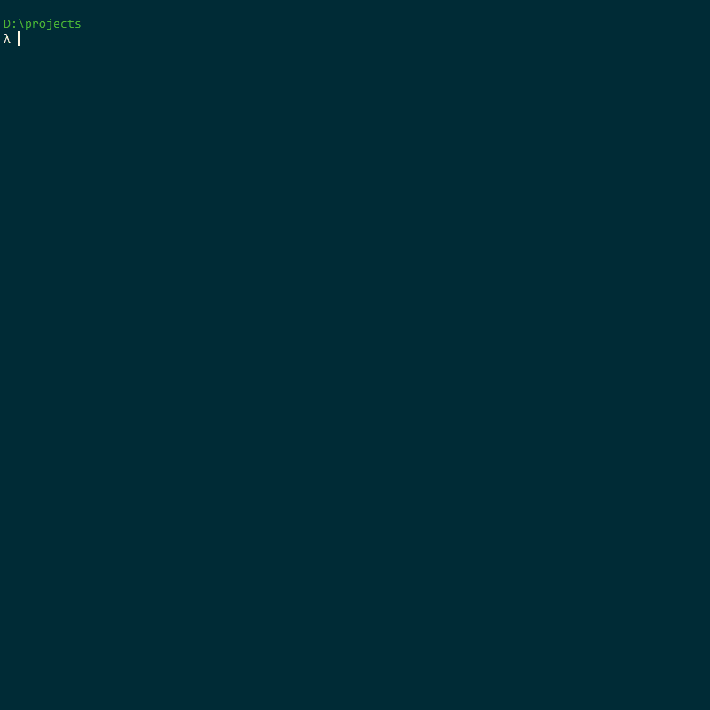

# Express App CLI

**express-app-cli** is an application that bootstraps your NodeJS / Express projects fast and easy.

## Installing and Using the CLI

In order to use the **express-app-cli** there are multiple options:
- By using **npx** *(only if you have NPM v5.2+ installed)*:
> npx express-app-cli < project-directory > [options]

- By installing the CLI globally:
> npm install -g express-app-cli
>
> express-app < project-directory >  [options]

- *Yarn support is yet to be added*.

## Overview

This CLI accepts multiple options used for configuring the project, such as:
- language template
- database
- testing library
- ORM (if using a SQL-based database. If using MongoDB, then Mongoose is automatically installed)
- templating engine

It handles installing the pre-defined and specified packages, creating a project structure and initializing Git, so all you have to do is just run `npm run watch` which will start your server (by default its on `PORT 3000`) and watch for any file changes that will trigger server restart, and you're good to go.

If no arguments are provided, then the user will be asked a series of questions on how to configure the project.

    

### Options

The list of options include:

    --default -> Creates a project with: Javascript, MongoDB & Jest

    # Languages
    --javascript -> selects Javascript as a language
    --typescript -> selects Typescript as a language

    # Databases
    --mongodb  -> selects MongoDB database (& Mongoose)
    --postgres -> selects Postgres database
    --mysql    -> selects MySQL database
    --sqlite   -> selects SQLite database

    # Testing Libraries
    --jest  -> Selects Jest testing library
    --chai  -> Selects Chai testing library
    --mocha -> Selects Mocha testing library

    # ORMs for SQL-based databases
    --sequelize -> Selects Sequelize ORM
    --typeorm   -> Selects TypeORM 

    # Templating Engines
    --handlebars -> Selects Handlebars templating engine
    --ejs -> Selects EJS templating engine
    --pug -> Selects Pug templating engine

    # Misc
    --version -> Provides the version of the application
    --help    -> Provides the information regarding the application

### Example

A quick example demonstrating the usage of the CLI:

    # Make a directory where you would like to create the project
    mkdir example

    # Create the project with the default configuration in the 'example' folder
    npx express-app-cli example\ --default

    # Change your current directory to the project's directory 
    cd example\

    # Start and watch the server for any changes
    npm run watch

## Contribution
If you have any recommendations for what can be improved or added to the CLI, please feel free to open a pull request.

When creating a new branch please follow the `feature/branch-name` convention if it's a feature to be added or updated. Or if its related to fixing a bug `bugfix/branch-name` convention. All pull requests then will be directed towards the `develop` branch.

If you find any bugs, please open an issue.